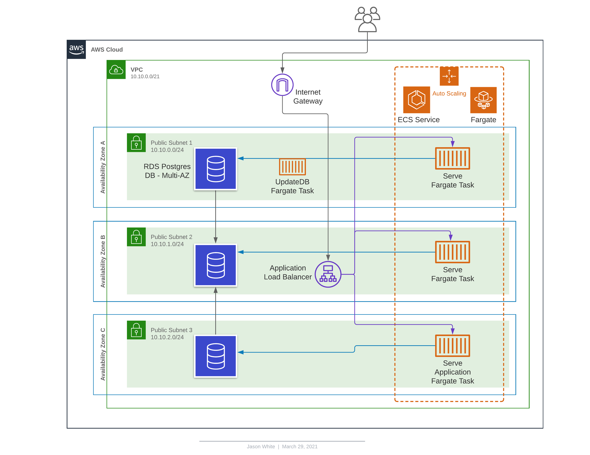

# Servian TechChallenge Solution

## Summary

The provided solution deploys the TechChallengeApp to AWS with a highly available, highly scalable server-less architecture, utilising:

- Multi-AZ RDS Postgres Database

- ECS Clusters with Fargate Tasks

- Auto Scaling of ECS Service

- Application Load Balancer

  
## Architectural Design



## Pre-Requisites

- The solution requires git to be installed, further information regarding this can be found at https://git-scm.com/about
- The solution requires aws-cli v2 to be installed and configured with access-id and secret key in region ap-southeast-2, further information regarding this can be found at https://docs.aws.amazon.com/cli/latest/userguide/install-cliv2-windows.html
- The  solution requires PowerShell, this can be found pre-installed on any Windows 10 installation, further information regarding this can be found at https://docs.microsoft.com/en-us/powershell/scripting/install/installing-powershell?view=powershell-7.1
- The solution requires Terraform to be installed, further information regarding this can be found at https://www.terraform.io/downloads.html


## File Structure

``` sh
├── alb.tf 					# Application Load Balancer
├── asg.tf 					# Auto Scaling Groups
├── deploy.ps1  			# PowerShell script to deploy the solution
├── ecs.tf 					# Elastic Container Cluster\Service\Tasks
├── main.tf					# Main Terraform - Sets Region
├── outputs.tf 				# Terraform Ouputs
├── rds.tf 					# RDS Database
├── README.md 				# Readme Documentation
├── sg.tf 					# Security Groups 
├── variables.tf 			# Variables
├── vpc_net.tf 				# VPC-Network
├── ssm.tf   				# Systems Manage Paramater Store
├── images     				# Image Directory
    ├── aws_design.png      # Infrastructure Design

```


## Deployment Summary

The solution is deployed by cloning the git repository, then running a PowerShell script which runs the following:

- Initialize Terraform
- Terraform Creates Infrastructure - **NOTE:** (Pre Approved)
- aws-cli to identify Subnet to run Fargate Task
- aws-cli to starts Fargate task on ECS Cluster to create table and seed database

**Note:** 

- Deployment region is pre-configured as ap-southeast-2, this can be modified in the main.tf file and aws configure command.
- Database password is randomly generated and is output for reference.
- The load balanced web endpoint URL is output for easy reference


## Deployment Usage

The deployment is designed to be deployed from a Windows Environment

```
git clone https://github.com/jasonwhiteaus/servian-techchallange.git
cd servian-techchallange
powershell -File .\deploy.ps1
```


## Clean-Up

Don't forget to cleanup after by running the command
```
terraform destroy
```

